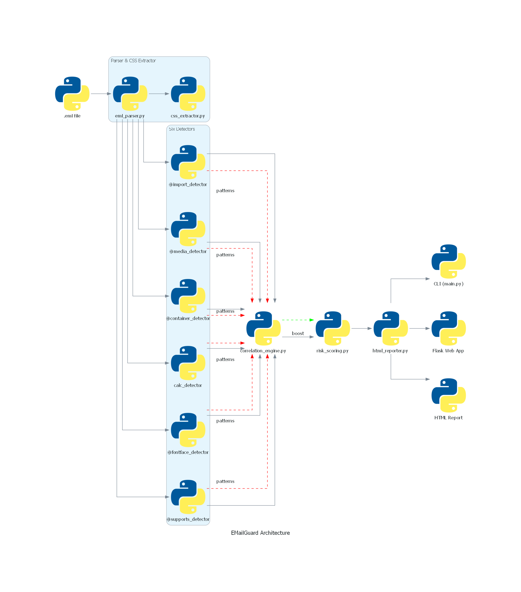

# EMailGuard – CSS Email Fingerprinting Analyzer

[](https://www.python.org/downloads/)
[](LICENSE)
[](https://www.ndss-symposium.org/)

**EMailGuard** is a static analysis tool that detects CSS‑based fingerprinting techniques in HTML email (`.eml`) files. Based on the research paper *Cascading Spy Sheets* (NDSS 2025) by Trampert et al., it identifies six distinct fingerprinting vectors, correlates them to uncover multi‑stage attacks, and produces a risk‑scored HTML report with actionable mitigations.

> 🛡️ **No JavaScript, no network requests, no rendering** – pure static analysis.

---

## 📖 Table of Contents
- [EMailGuard – CSS Email Fingerprinting Analyzer](#emailguard--css-email-fingerprinting-analyzer)
  - [📖 Table of Contents](#-table-of-contents)
  - [✨ Features](#-features)
  - [🧠 How It Works](#-how-it-works)
  - [📄 Research Basis](#-research-basis)
  - [👥 Team \& Roles](#-team--roles)
    - [👤 J V M Bhargav (2023UCP1673) – Pipeline \& Core Logic](#-j-v-m-bhargav-2023ucp1673--pipeline--core-logic)
    - [👤 Pathi Jahnavi (2023UCP1595) – Detection \& Output](#-pathi-jahnavi-2023ucp1595--detection--output)
    - [🤝 Shared Responsibilities](#-shared-responsibilities)
  - [🛠 Installation](#-installation)
  - [🚀 Usage](#-usage)
    - [Command Line](#command-line)
    - [Web Interface (Flask)](#web-interface-flask)
  - [📂 Dataset](#-dataset)
  - [🏗 Architecture](#-architecture)
  - [🧪 Testing \& Evaluation](#-testing--evaluation)
  - [🔮 Future Work](#-future-work)
  - [🙏 Acknowledgments](#-acknowledgments)
  - [📄 License](#-license)

---

## ✨ Features

- **6 CSS Fingerprinting Detectors** (directly from the paper):
  - `@import` external URL chain
  - `@media` conditional resource loading (viewport probing)
  - `@container` queries (font detection + exfiltration)
  - `calc()` with trigonometric functions (OS/architecture leakage)
  - `@font-face` remote font loading
  - `@supports` browser feature probing
- **Correlation Engine** – identifies multi‑stage fingerprinting (e.g., `@supports` → `@media` → `calc()`)
- **Risk Scoring** – weighted base scores + correlation boosts → final risk label (Safe / Moderate / High / Critical)
- **Command‑Line Interface (CLI)** – process single `.eml` files, output JSON or HTML
- **Web Interface** – upload `.eml` via Flask, view/download rich HTML report
- **Offline & Safe** – never fetches external resources or executes JavaScript

---

## 🧠 How It Works

```
.eml → Parser → CSS Extractor → 6 Detectors → Correlation → Risk Scoring → Report (CLI/Web)
```

1. **Parse** – extract HTML body and metadata (subject, sender, date) from `.eml`.
2. **Extract CSS** – from `<style>` tags, inline `style=""` attributes, `<link>` references, and `@import` statements.
3. **Detect** – run six pattern‑based detectors; each returns a `Finding` with snippet, risk level, and paper reference.
4. **Correlate** – combine findings to detect advanced attack patterns (e.g., progressive probing, exfiltration chains).
5. **Score** – calculate overall risk (0–100) and assign label.
6. **Report** – generate standalone HTML report (or print to console with `--verbose`).

---

## 📄 Research Basis

This project directly implements techniques from:

> **Leon Trampert, Daniel Weber, Lukas Gerlach, Christian Rossow, Michael Schwarz.** *Cascading Spy Sheets: Exploiting the Complexity of Modern CSS for Email and Browser Fingerprinting*. NDSS 2025.  
> [Paper PDF](https://www.ndss-symposium.org/ndss-paper/cascading-spy-sheets/) | [Official Artifact](https://github.com/cispa/cascading-spy-sheets)

| Technique | Paper Section |
|-----------|---------------|
| `@import` chain | IV‑B, VIII‑C2 |
| `@media` conditional | III‑B, IV‑A3 |
| `@container` query | IV‑A, Listing 1 |
| `calc()` expressions | V‑A, Listing 3 |
| `@font-face` remote | III‑B, IV‑C1 |
| `@supports` probe | IV‑B, IV‑C2 |
| Correlation & Scoring | – (our extension) |
| Mitigations | IX‑B |

We used the **official NDSS 2025 artifact** only for test `.eml` files (email PoCs). No code was copied; all detectors are original implementations.

---

## 👥 Team & Roles

### 👤 J V M Bhargav (2023UCP1673) – Pipeline & Core Logic
- `.eml` parser & CSS extractor
- Detectors: `@import`, `@media`, `@container`
- Correlation engine
- CLI interface
- Integration & deployment (Render)

### 👤 Pathi Jahnavi (2023UCP1595) – Detection & Output
- Detectors: `calc()`, `@font-face`, `@supports`
- Risk scoring
- Flask web app backend
- HTML report generation (Jinja2, styling)

### 🤝 Shared Responsibilities
- Unit & integration tests
- Edge‑case testing
- Dataset creation (synthetic + clean)
- Documentation & PPT

---

## 🛠 Installation

```bash
# Clone the repository
git clone https://github.com/yourusername/EMailGuard.git
cd EMailGuard

# Create a virtual environment (optional but recommended)
python -m venv venv
source venv/bin/activate   # On Windows: venv\Scripts\activate

# Install dependencies
pip install -r requirements.txt
```

**`requirements.txt`**:
```
beautifulsoup4>=4.12
lxml>=4.9
jinja2>=3.1
flask>=2.3
pytest>=7.4
tinycss2>=1.2
```

---

## 🚀 Usage

### Command Line

```bash
# Basic analysis – generates HTML report
python main.py --input sample.eml --output report.html

# Verbose output (prints findings to console)
python main.py --input sample.eml --verbose

# Summary only (risk score + label)
python main.py --input sample.eml --summary
```

**Example output (verbose):**
```
[!] CRITICAL: @import chain
    Snippet: @import url("http://evil.com/tracker.css");
    Paper: Section IV-B, VIII-C2
    Mitigation: Use a proxy that inlines external resources.

[!] HIGH: calc() expression with trig functions
    Snippet: width: calc(sin(45deg) * 100px);
    Paper: Section V-A, Listing 3
    Mitigation: Preload all dynamic resources.

Risk score: 72/100 (Critical)
Report saved to report.html
```

### Web Interface (Flask)

```bash
python web/app.py
# Open http://127.0.0.1:5000 in your browser
```

Upload an `.eml` file, and you'll get a detailed HTML report with expandable CSS snippets, correlation insights, and mitigation advice.

---

## 📂 Dataset

We evaluated EMailGuard on a curated dataset of **23 emails** across three categories:

| Category | Count | Source |
|----------|-------|--------|
| Paper PoCs | 6 | Official NDSS 2025 artifact (`pocs/email/`) |
| Synthetic attacks | 7 | Created by modifying PoCs (nested `@media`, obfuscated `calc()`, multiple `@import`, inline‑only CSS, malformed CSS) |
| Clean emails | 10 | Exported newsletters (no CSS fingerprinting) |

All test emails are in the `test_samples/` folder of this repository.

---

## 🏗 Architecture



The pipeline flows as follows:
1. `.eml file` → `eml_parser.py` → `css_extractor.py`
2. CSS snippets fed in parallel to all **6 detectors**
3. Each detector returns `Finding` patterns → `correlation_engine.py`
4. Correlation boost → `risk_scoring.py` → `html_reporter.py`
5. Output via **CLI** (`main.py`), **Flask Web App**, or standalone **HTML Report**

---

## 🧪 Testing & Evaluation

Run all tests:
```bash
pytest tests/
```

**Test coverage:**
- Unit tests for each detector (positive & negative cases)
- Integration tests for the full pipeline on all dataset emails
- Edge cases: malformed HTML, empty CSS, only inline styles
- False‑positive measurement on clean emails

**Evaluation metrics (from our runs):**

| Metric | Result |
|--------|--------|
| Paper PoCs detection rate | **100%** (6/6) |
| Synthetic attacks detection rate | **85.7%** (6/7) |
| False positive rate on clean emails | **0%** (0/10) |
| Average processing time | **1.2s** (range: 0.8–2.0s, on i7‑1255U) |

*Detailed results and per-detector accuracy are in the [project report](report.pdf).*


---

## 🔮 Future Work

- **Visualization:** Charts showing technique distribution per email.
- **Explainability:** Plain‑English explanations of what each finding reveals about the user.
- **Automated mitigation:** Integrate with email filters (e.g., rewrite suspicious CSS to `style` attributes).
- **Browser extension:** Real‑time scanning of email in web clients (Gmail, Outlook).
- **ML‑based classification:** For obfuscated or novel patterns.

---

## 🙏 Acknowledgments

- The authors of *Cascading Spy Sheets* for their groundbreaking research and publicly available artifact.
- Dr. Ramesh Babu Bathula for guidance and feedback throughout the project.

---

## 📄 License

This project is licensed under the MIT License – see the [LICENSE](LICENSE) file for details.

---

*Built with ❤️ by J V M Bhargav & Pathi Jahnavi for the Computer and Network Security course (22CST352), MNIT Jaipur.*